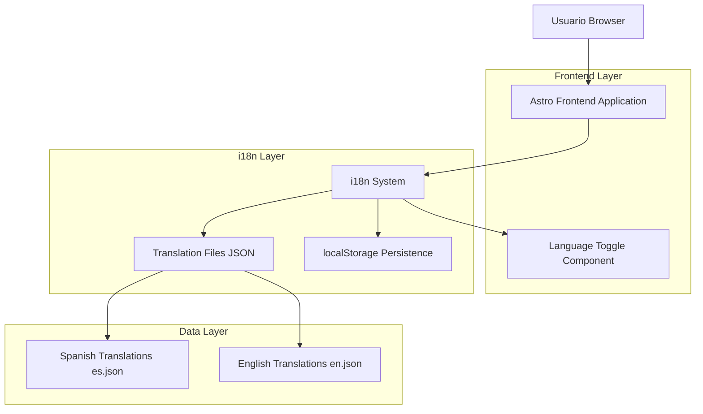
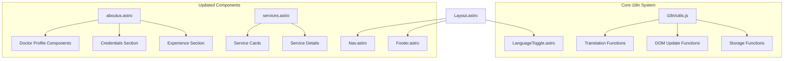
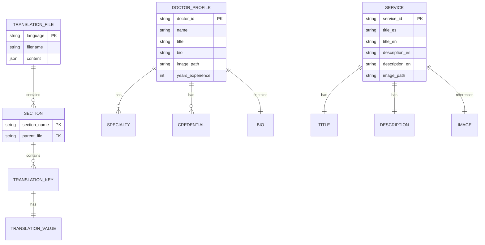

# Arquitectura Técnica - Sistema i18n Car Injury Clinic

## 1. Arquitectura del Sistema



## 2. Descripción de Tecnologías

- **Frontend**: Astro@4 + JavaScript ES6 + CSS3
- **i18n System**: Custom JavaScript implementation
- **Storage**: localStorage (browser native)
- **Data Format**: JSON translation files

## 3. Definiciones de Rutas

| Ruta | Propósito | i18n Support |
|------|-----------|--------------|
| / | Página principal con hero y servicios | ✅ Completo |
| /aboutus | Perfiles de doctores actualizados | ✅ Completo |
| /services | Lista completa de servicios médicos | ✅ Completo |
| /schedule | Formulario de agendamiento | ✅ Completo |
| /formulario | Formulario de contacto | ✅ Completo |
| /contact | Información de contacto | ✅ Completo |
| /faq | Preguntas frecuentes | ✅ Completo |

## 4. API de Internacionalización

### 4.1 Core i18n Functions

**Función getCurrentLanguage()**
```javascript
// Obtiene el idioma actual del localStorage o default 'es'
function getCurrentLanguage() {
  return localStorage.getItem('language') || 'es';
}
```

**Función setLanguage()**
```javascript
// Cambia y persiste el idioma seleccionado
function setLanguage(lang) {
  localStorage.setItem('language', lang);
  loadTranslations(lang);
}
```

**Función loadTranslations()**
```javascript
// Carga archivo JSON de traducciones
async function loadTranslations(lang) {
  const response = await fetch(`/src/i18n/translations/${lang}.json`);
  const translations = await response.json();
  updateDOM(translations);
}
```

### 4.2 Translation File Structure

**Estructura de es.json:**
```json
{
  "nav": {
    "home": "Inicio",
    "about": "Nosotros", 
    "services": "Servicios",
    "contact": "Contacto",
    "schedule": "Agendar"
  },
  "hero": {
    "title": "Recupera tu Bienestar Después de un Accidente",
    "subtitle": "Atención médica especializada...",
    "cta": "Agenda tu Consulta Gratuita"
  },
  "aboutus": {
    "title": "Nuestro Equipo Médico",
    "subtitle": "Especialistas en Manejo del Dolor y Quiropráctica",
    "doctors": {
      "ana": {
        "name": "Dra. Ana Ramírez",
        "title": "Especialista en Lesiones Cervicales",
        "bio": "Especialista en quiropráctica con más de 12 años de experiencia en el tratamiento de lesiones por accidentes automovilísticos. Se enfoca en técnicas no invasivas para el alivio del dolor cervical y la restauración de la movilidad.",
        "specialties": [
          "Terapia Quiropráctica",
          "Manejo del Dolor Cervical", 
          "Rehabilitación de Lesiones",
          "Terapia de Ultrasonido"
        ],
        "credentials": [
          "Doctora en Quiropráctica (DC)",
          "Certificada en Trauma Vehicular",
          "Especialista en Técnicas de Movilización"
        ]
      },
      "marco": {
        "name": "Dr. Marco López", 
        "title": "Especialista en Rehabilitación Funcional",
        "bio": "Experto en rehabilitación funcional con enfoque en la recuperación completa de pacientes post-accidente. Utiliza técnicas avanzadas de terapia física y electroestimulación para restaurar la función normal.",
        "specialties": [
          "Rehabilitación de Lesiones",
          "Terapia Física Avanzada",
          "Terapia TENS",
          "Fortalecimiento Muscular"
        ],
        "credentials": [
          "Doctor en Quiropráctica (DC)",
          "Certificado en Rehabilitación Funcional", 
          "Especialista en Electroestimulación"
        ]
      },
      "johnny": {
        "name": "Dr. Johnny Wong",
        "title": "Especialista en Manejo del Dolor",
        "bio": "Especialista en manejo integral del dolor con más de 15 años de experiencia. Se especializa en técnicas no farmacológicas para el control del dolor crónico y agudo post-accidente.",
        "specialties": [
          "Manejo del Dolor Crónico",
          "Terapia de Masaje Terapéutico",
          "Terapia Frio-Calor",
          "Técnicas de Relajación Muscular"
        ],
        "credentials": [
          "Doctor en Quiropráctica (DC)",
          "Certificado en Manejo del Dolor",
          "Especialista en Terapias No Invasivas"
        ]
      }
    }
  },
  "services": {
    "title": "Nuestros Servicios Médicos",
    "subtitle": "Tratamientos especializados para tu recuperación",
    "items": {
      "quiropractica": {
        "title": "Terapia Quiropráctica",
        "description": "Ajustes específicos y técnicas suaves para alinear la columna, reducir la inflamación y mejorar la movilidad tras un accidente."
      },
      "rehabilitacion": {
        "title": "Rehabilitación de Lesiones", 
        "description": "Planes de rehabilitación personalizados que abordan la causa de tus síntomas y aceleran la recuperación funcional."
      },
      "manejo-dolor": {
        "title": "Especialista en Manejo del Dolor",
        "description": "Tratamientos médicos avanzados para controlar el dolor crónico, restaurar la movilidad y mejorar la calidad de vida."
      }
    }
  },
  "contact": {
    "title": "Contáctanos",
    "phone": "Teléfono",
    "address": "Dirección", 
    "hours": "Horarios de Atención",
    "cta": "Llama Ahora"
  },
  "footer": {
    "rights": "Todos los derechos reservados",
    "privacy": "Política de Privacidad",
    "terms": "Términos de Servicio"
  }
}
```

## 5. Arquitectura de Componentes



## 6. Modelo de Datos

### 6.1 Definición del Modelo de Datos



### 6.2 Estructura de Archivos de Traducción

**Archivo es.json (Español):**
```json
{
  "nav": { "home": "Inicio", "about": "Nosotros" },
  "aboutus": {
    "doctors": {
      "ana": {
        "specialties": [
          "Terapia Quiropráctica",
          "Manejo del Dolor Cervical",
          "Rehabilitación de Lesiones", 
          "Terapia de Ultrasonido"
        ]
      }
    }
  }
}
```

**Archivo en.json (English):**
```json
{
  "nav": { "home": "Home", "about": "About Us" },
  "aboutus": {
    "doctors": {
      "ana": {
        "specialties": [
          "Chiropractic Therapy",
          "Cervical Pain Management", 
          "Injury Rehabilitation",
          "Ultrasound Therapy"
        ]
      }
    }
  }
}
```

### 6.3 Inicialización del Sistema

**Script de inicialización:**
```javascript
// Inicializar sistema i18n al cargar la página
document.addEventListener('DOMContentLoaded', function() {
  const currentLang = getCurrentLanguage();
  loadTranslations(currentLang);
  updateLanguageToggle(currentLang);
});

// Configurar event listeners para botones de idioma
document.querySelectorAll('[data-lang]').forEach(button => {
  button.addEventListener('click', function() {
    const newLang = this.getAttribute('data-lang');
    setLanguage(newLang);
    updateLanguageToggle(newLang);
  });
});
```

## 7. Consideraciones de Performance

### 7.1 Optimizaciones
- **Lazy Loading**: Cargar traducciones solo cuando se necesiten
- **Caching**: Mantener traducciones en memoria después de la primera carga
- **Minificación**: Comprimir archivos JSON de traducciones
- **Debouncing**: Evitar múltiples actualizaciones del DOM

### 7.2 Métricas de Performance
- Tiempo de carga inicial: < 100ms
- Tiempo de cambio de idioma: < 50ms
- Tamaño de archivos de traducción: < 50KB cada uno
- Impacto en bundle size: < 10KB adicionales

Este sistema proporcionará una experiencia de internacionalización robusta y eficiente para Car Injury Clinic, permitiendo a los usuarios alternar entre español e inglés de manera fluida y manteniendo toda la funcionalidad del sitio web.