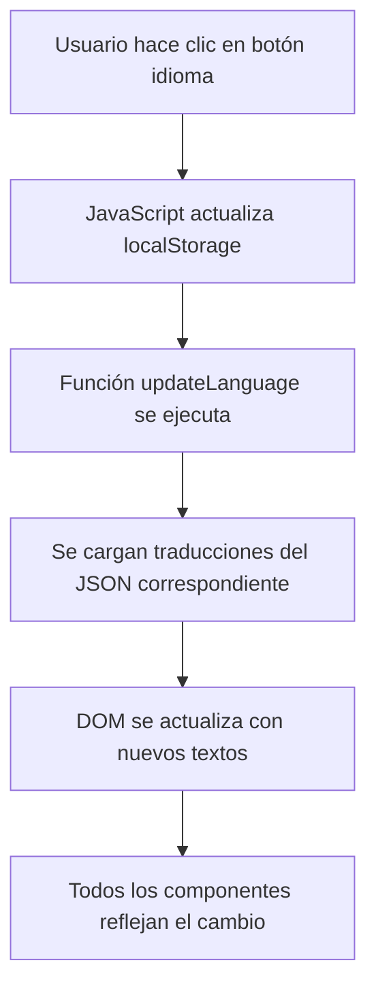

# Sistema de Internacionalización (i18n) - Car Injury Clinic

## 1. Resumen del Proyecto

Implementación de un sistema completo de internacionalización para el sitio web de Car Injury Clinic que permita alternar entre español e inglés de forma dinámica, con persistencia del idioma seleccionado y actualización de todos los componentes en tiempo real.

## 2. Características Principales

### 2.1 Funcionalidades Core
- **Botón de cambio de idioma**: Disponible en todos los componentes principales
- **Traducción dinámica**: Cambio instantáneo sin recarga de página
- **Persistencia**: El idioma seleccionado se guarda en localStorage
- **Cobertura completa**: Todos los textos, botones y contenido traducido
- **Perfiles actualizados**: Doctores especializados en servicios reales de la clínica

### 2.2 Componentes Afectados
- Navigation (Nav.astro)
- Footer (Footer.astro)
- Hero sections (Hero.astro, HeroServices.astro, HeroLawyer.astro)
- About Us (aboutus.astro) - **Actualización completa de perfiles**
- Services (services.astro)
- Contact (MapContact.astro)
- Forms (Form.astro, formulario.astro)
- All CTA buttons and links

## 3. Arquitectura del Sistema

### 3.1 Estructura de Archivos
```
src/
├── i18n/
│   ├── translations/
│   │   ├── es.json
│   │   └── en.json
│   ├── utils.js
│   └── LanguageToggle.astro
├── components/
│   └── [todos los componentes actualizados]
└── pages/
    └── [todas las páginas actualizadas]
```

### 3.2 Flujo de Funcionamiento


## 4. Implementación Técnica

### 4.1 Archivos de Traducción

**Estructura del archivo es.json:**
```json
{
  "nav": {
    "home": "Inicio",
    "about": "Nosotros",
    "services": "Servicios",
    "contact": "Contacto",
    "schedule": "Agendar"
  },
  "aboutus": {
    "title": "Nuestro Equipo Médico",
    "subtitle": "Especialistas en Manejo del Dolor y Quiropráctica",
    "doctors": {
      "ana": {
        "name": "Dra. Ana Ramírez",
        "title": "Especialista en Lesiones Cervicales",
        "bio": "Especialista en quiropráctica con enfoque en lesiones por accidentes automovilísticos...",
        "specialties": [
          "Terapia Quiropráctica",
          "Rehabilitación de Lesiones",
          "Manejo del Dolor Cervical",
          "Terapia de Ultrasonido"
        ]
      }
    }
  }
}
```

**Estructura del archivo en.json:**
```json
{
  "nav": {
    "home": "Home",
    "about": "About Us",
    "services": "Services",
    "contact": "Contact",
    "schedule": "Schedule"
  },
  "aboutus": {
    "title": "Our Medical Team",
    "subtitle": "Pain Management and Chiropractic Specialists",
    "doctors": {
      "ana": {
        "name": "Dr. Ana Ramírez",
        "title": "Cervical Injury Specialist",
        "bio": "Chiropractic specialist focused on car accident injuries...",
        "specialties": [
          "Chiropractic Therapy",
          "Injury Rehabilitation", 
          "Cervical Pain Management",
          "Ultrasound Therapy"
        ]
      }
    }
  }
}
```

### 4.2 Componente LanguageToggle

**Características:**
- Botón visual con banderas o iconos de idioma
- Estado activo visible
- Integración en Nav.astro y Footer.astro
- Funcionalidad JavaScript para cambio dinámico

### 4.3 Utilidades JavaScript

**Funciones principales:**
- `getCurrentLanguage()`: Obtiene idioma actual de localStorage
- `setLanguage(lang)`: Cambia y persiste el idioma
- `loadTranslations(lang)`: Carga archivo JSON correspondiente
- `updateDOM(translations)`: Actualiza todos los elementos con data-i18n

## 5. Actualización de Perfiles de Doctores

### 5.1 Cambios Requeridos en aboutus.astro

**Eliminar:**
- Referencias a universidades/colegios específicos
- Credenciales académicas inventadas
- Especialidades no relacionadas con los servicios

**Actualizar con:**
- Especialidades basadas en servicios reales de la clínica
- Experiencia en manejo del dolor post-accidente
- Certificaciones en técnicas quiropráctica
- Enfoque en rehabilitación de lesiones vehiculares

### 5.2 Servicios Reales para Especialidades

**Servicios disponibles en la clínica:**
1. Terapia Quiropráctica
2. Rehabilitación de Lesiones
3. Terapia Física
4. Terapia Frio-Calor
5. Terapia de Masaje
6. Terapia de Ultrasonido
7. Terapia TENS (Electroestimulación)
8. Manejo del Dolor
9. Segundas Opiniones
10. Radiografías Digitales
11. Solicitud de MRI
12. Consultas Quirúrgicas
13. Diagnóstico de Conmoción

### 5.3 Perfiles Actualizados

**Dr. Ana Ramírez - Especialista en Lesiones Cervicales:**
- Especialidades: Terapia Quiropráctica, Manejo del Dolor Cervical, Terapia de Ultrasonido
- Enfoque: Lesiones de cuello por accidentes automovilísticos
- Experiencia: Rehabilitación post-accidente

**Dr. Marco López - Especialista en Rehabilitación Funcional:**
- Especialidades: Rehabilitación de Lesiones, Terapia Física, Terapia TENS
- Enfoque: Recuperación funcional completa
- Experiencia: Lesiones de espalda baja y extremidades

**Dr. Johnny Wong - Especialista en Manejo del Dolor:**
- Especialidades: Manejo del Dolor, Terapia de Masaje, Terapia Frio-Calor
- Enfoque: Control del dolor crónico post-accidente
- Experiencia: Técnicas no invasivas de alivio del dolor

## 6. Plan de Implementación

### 6.1 Fase 1: Estructura Base
1. Crear carpeta `src/i18n/` con archivos de traducción
2. Desarrollar utilidades JavaScript para i18n
3. Crear componente LanguageToggle.astro

### 6.2 Fase 2: Actualización de Componentes
1. Actualizar Nav.astro con botón de idioma
2. Modificar aboutus.astro con perfiles realistas
3. Actualizar todos los componentes con atributos data-i18n

### 6.3 Fase 3: Integración y Testing
1. Integrar sistema en todas las páginas
2. Probar cambio de idioma en todos los componentes
3. Verificar persistencia en localStorage
4. Validar traducciones completas

## 7. Consideraciones Técnicas

### 7.1 Performance
- Carga lazy de archivos de traducción
- Cache de traducciones en memoria
- Minimización de re-renders del DOM

### 7.2 SEO
- Meta tags dinámicos por idioma
- URLs amigables (opcional: /es/ y /en/)
- Hreflang tags para motores de búsqueda

### 7.3 Accesibilidad
- Aria-labels traducidos
- Navegación por teclado del botón de idioma
- Anuncio de cambio de idioma para lectores de pantalla

## 8. Mantenimiento

### 8.1 Agregar Nuevas Traducciones
1. Actualizar archivos JSON en ambos idiomas
2. Agregar atributos data-i18n a nuevos elementos
3. Probar funcionamiento en ambos idiomas

### 8.2 Actualización de Contenido
- Mantener sincronización entre es.json y en.json
- Revisar traducciones médicas para precisión
- Validar terminología legal en ambos idiomas

Este sistema proporcionará una experiencia bilingüe completa y profesional para los usuarios de Car Injury Clinic, mejorando la accesibilidad y alcance del sitio web.